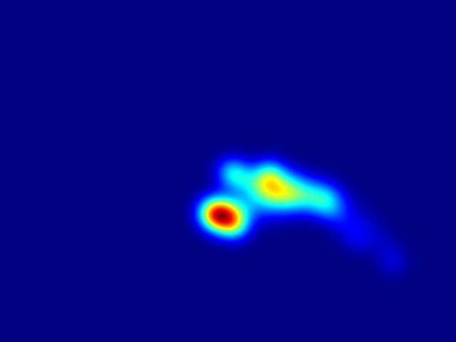

# Eye Tracking System with OpenCV and MediaPipe

This project is an eye tracking system built using OpenCV, Dlib, and MediaPipe. It processes video input to detect eye landmarks, analyze gaze direction, and visualize attention using heatmaps.

## Features

- Real-time eye tracking using webcam or video files
- Facial and eye landmark detection with MediaPipe and Dlib
- Gaze direction analysis
- AOI (Area of Interest) tracking
- Heatmap visualization of gaze points

## Demo



## Installation

1. **Clone the repository**

```bash
git clone https://github.com/yourusername/cv2-eye-tracking-system.git
cd cv2-eye-tracking-system
```

## Requirements
* Python 3.7+
* OpenCV
* NumPy
* Dlib
* MediaPipe

##Usage
Navigate to the src directory and run:

```bash
python gaze_analysis.py
```
Or run other scripts like:

```bash
python eye_landmarks.py
python AOI.py
```
Note: Adjust the input source (webcam or video file) in the script if needed.

Project Structure
```perl
cv2-eye-tracking-system/
│
├── src/
│   ├── gaze_analysis.py        # Main gaze tracking script
│   ├── eye_landmarks.py        # Eye detection and landmarking
│   ├── AOI.py                  # Area of Interest processing
│   └── old_work/               # Legacy or experimental scripts
│
├── eye_gaze_heatmap.jpg        # Sample heatmap image
├── requirements.txt
└── README.md
```
  
