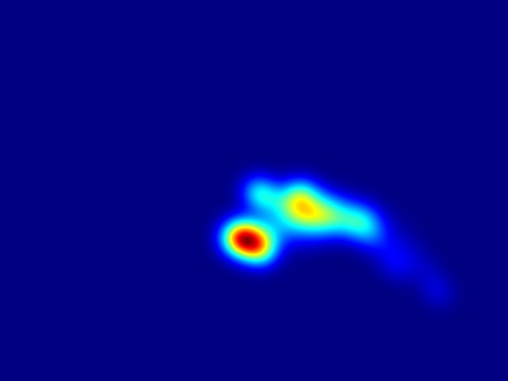

# Eye Tracking System with OpenCV and MediaPipe

Real-time eye tracking pipeline built with Python, OpenCV, and MediaPipe FaceMesh. Tracks iris position, estimates head pose in 3D, detects fixations and blinks, maps gaze to Areas of Interest, and exports per-frame metrics to CSV for offline analysis.

## Demo



---

## Features

| Feature | Details |
|---|---|
| **Iris gaze estimation** | Tracks iris position within eye bounds using MediaPipe's 478-point mesh (landmarks 468–477). Outputs normalized horizontal/vertical gaze ratios. |
| **3D head pose** | `cv2.solvePnP` on 6 facial landmarks → roll, pitch, yaw in degrees. Axes drawn on nose tip in real time. |
| **Blink detection** | Eye Aspect Ratio (EAR) formula on both eyes; blink flagged when avg EAR < 0.20. |
| **Gaze direction estimation** | Fuses iris ratios with head-pose yaw/pitch to produce a head-independent gaze direction vector (dir_h, dir_v) in [-1, 1]. Visualised as a live miniature indicator overlay. |
| **Fixation detection** | Velocity-based classifier: gaze velocity < 25 px/s for ≥ 100 ms = fixation. Completed fixations logged with duration and position. |
| **AOI tracking** | Configurable rectangular Areas of Interest with per-AOI dwell time accumulation. |
| **Heatmap overlay** | Gaussian-blurred JET colormap overlaid on the live frame. |
| **CSV export** | Per-frame record saved to `data/gaze_<timestamp>.csv` on exit. |

---

## Installation

**conda (recommended):**
```bash
git clone https://github.com/apayne185/cv2-eye-tracking-system.git
cd cv2-eye-tracking-system
conda env create -f environment.yml
conda activate eyetrack
```

**pip / venv:**
```bash
pip install -r requirements.txt
```

**Requirements:** Python 3.11, opencv-python, numpy, mediapipe, pandas

---

## Usage

```bash
# Default: webcam 0
python src/main.py

# Specific webcam index
python src/main.py --source 1

# Process a recorded video file
python src/main.py --source path/to/video.mp4

# Custom output directory
python src/main.py --source 0 --output-dir results/
```

Press **`q`** to quit — the session CSV and heatmap are saved automatically.

---

## Output

### Session summary (printed on exit)
```
--- Session Summary ---
Frames recorded:  1842
Blinks detected:  12
Fixation frames:  1104  (59.9%)
Fixations:        38  avg=0.31s  max=1.74s

AOI dwell (frames):
  Center: 812  (44.1%)
  Left:   391  (21.2%)
  Right:  201  (10.9%)
```

### CSV schema
| Column | Description |
|---|---|
| `frame` | Frame index |
| `timestamp` | Unix timestamp |
| `gaze_x`, `gaze_y` | Iris center in pixel coordinates |
| `gaze_ratio_h`, `gaze_ratio_v` | Normalized gaze position within eye (0–1) |
| `pitch`, `yaw`, `roll` | Head Euler angles in degrees |
| `left_ear`, `right_ear` | Eye Aspect Ratio per eye |
| `is_blink` | Boolean |
| `is_fixation` | Boolean |
| `dir_h`, `dir_v` | Estimated gaze direction in [-1, 1] (iris + head pose fused) |
| `ray_ox`, `ray_oy`, `ray_oz` | 3D gaze ray origin (eye midpoint in camera coords, mm) |
| `ray_dx`, `ray_dy`, `ray_dz` | 3D gaze ray unit direction vector in camera coords |
| `active_aoi` | Name of active Area of Interest, or null |

---

## Project Structure

```
cv2-eye-tracking-system/
├── src/
│   ├── main.py             # Entry point — argparse, main loop, CSV export
│   ├── eye_tracker.py      # EyeTracker class: iris gaze, EAR blink, fixation
│   ├── head_pose.py        # HeadPoseEstimator: solvePnP, draw_axes
│   ├── direction.py        # GazeDirectionEstimator: fuses iris + head pose
│   ├── gaze_analysis.py    # Heatmap accumulator and renderer
│   ├── AOI.py              # AOITracker class with dwell-time accumulation
│   └── old_work/           # Legacy scripts (reference only)
├── tests/
│   ├── test_direction.py   # Direction estimator unit tests
│   ├── test_fixation.py    # Fixation state machine unit tests
│   └── test_gaze_analysis.py  # Heatmap accumulator unit tests
├── eye_gaze_heatmap.jpg    # Sample heatmap output
├── requirements.txt
└── README.md
```

---

## Technical Notes

**Why iris landmarks over eye center averaging?**  
The earlier approach averaged the positions of all eye *outline* landmarks, which tracks face movement but not gaze direction. The iris landmarks (MediaPipe 468–477, enabled via `refine_landmarks=True`) give the actual pupil/iris position, so moving your eyes while keeping your head still produces a meaningful signal.

**Head pose as gaze context**  
`solvePnP` maps six 2D facial landmarks to a known 3D face model to recover the rotation matrix. Roll/pitch/yaw complement the iris ratios: a centered iris with a 30° yaw still points off-center in world space. These extrinsics feed directly into the 3D gaze ray computation.

**Fixation vs. saccade**  
The velocity threshold (25 px/s) follows the I-VT (Identification by Velocity Threshold) algorithm common in psychophysics research. Saccades typically exceed 300 px/s; the threshold is conservative to reduce noise from head micro-movements.

**Gaze direction fusion**  
Iris ratios alone are relative to the eye socket — they correctly detect eye movement but are blind to head rotation. `solvePnP` yaw and pitch capture head orientation but ignore where the eyes point within the socket. `GazeDirectionEstimator` linearly combines both signals: `dir_h = iris_deviation * EYE_SCALE + yaw * HEAD_SCALE`. The weights are empirically tuned; a calibration step (mapping known gaze targets to measured ratios) would improve absolute accuracy.

---

## Running the tests

```bash
conda activate eyetrack
pip install pytest
pytest tests/ -v
```
