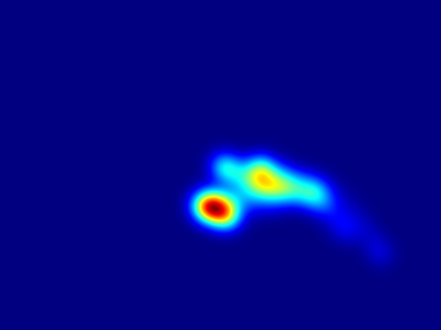

# Eye Tracking System with OpenCV and MediaPipe

[](https://github.com/apayne185/cv2-eye-tracking-system/actions/workflows/ci.yml)
[](https://github.com/apayne185/cv2-eye-tracking-system/actions/workflows/codeql.yml)

[](https://github.com/astral-sh/ruff)

Real-time eye tracking pipeline built with Python, OpenCV, and MediaPipe FaceMesh. Tracks iris position, estimates head pose in 3D, detects fixations and blinks, maps gaze to Areas of Interest, and exports per-frame metrics to CSV for offline analysis.

## Demo



---

## Features

| Feature | Details |
|---|---|
| **Iris gaze estimation** | Tracks iris position within eye bounds using MediaPipe's 478-point mesh (landmarks 468–477). Outputs normalized horizontal/vertical gaze ratios. |
| **3D head pose** | `cv2.solvePnP` (SQPnP) fitting all 468 FaceMesh landmarks to MediaPipe's life-size canonical face model → roll, pitch, yaw in degrees and head distance in mm. Axes drawn on nose tip in real time. |
| **Blink detection** | Eye Aspect Ratio (EAR) formula on both eyes; blink flagged when avg EAR < 0.20. |
| **Gaze direction estimation** | Fuses iris ratios with head-pose yaw/pitch to produce a head-independent gaze direction vector (dir_h, dir_v) in [-1, 1]. Visualised as a live miniature indicator overlay. |
| **3D point cloud export** | `--export-ply` writes two PLY files on exit: (1) sampled face mesh landmarks coloured by time, (2) 3D gaze ray endpoints coloured by horizontal position. Viewable in MeshLab, CloudCompare, or Open3D. |
| **Fixation detection** | Velocity-based classifier: gaze velocity < 25 px/s for ≥ 100 ms = fixation. Completed fixations logged with duration and position. |
| **AOI tracking** | Configurable rectangular Areas of Interest with per-AOI dwell time accumulation. |
| **Heatmap overlay** | Gaussian-blurred JET colormap overlaid on the live frame. |
| **Gaze attention classifier** | sklearn Random Forest trained on 5 gaze features → predicts `on_screen` / `peripheral` / `away` with >95% CV accuracy. Demonstrated in `notebooks/classifier.ipynb`. |
| **5-point gaze calibration** | `--calibrate` displays fixation targets, collects per-user iris ratio samples, and fits a `LinearRegression` mapping iris space → screen space. Saved to `models/calibration.json` and auto-loaded on subsequent runs. |
| **CSV export** | Per-frame record saved to `data/gaze_<timestamp>.csv` on exit. |

---

## Installation

**conda (recommended):**
```bash
git clone https://github.com/apayne185/cv2-eye-tracking-system.git
cd cv2-eye-tracking-system
conda env create -f environment.yml    # installs the package + dev tools
conda activate eyetrack
```

**pip / venv:**
```bash
python3.11 -m venv .venv && source .venv/bin/activate
pip install -e .                       # the `eyetrack` command + pinned runtime deps
pip install -r requirements-dev.txt    # + pytest, ruff, pre-commit, jupyterlab
```

**Requirements:** Python 3.11 (mediapipe 0.10.9 has no wheels for 3.12+). All versions are pinned in `requirements.txt`.

**Windows note:** tested on Windows 11. The pytest config disables the `dash` pytest plugin, which conflicts with mediapipe's DLL initialisation on Windows.

---

## Usage

```bash
eyetrack run                                  # webcam 0 with live preview (press q to stop)
eyetrack run --source 1                       # another webcam
eyetrack run --source path/to/video.mp4       # recorded video
eyetrack run --source rtsp://camera/stream    # network camera
eyetrack run --export-ply                     # also export PLY point clouds
eyetrack run --calibrate                      # 5-point calibration first (saved to models/)
eyetrack calibrate                            # calibration only

# Headless (servers, containers, CI): no window; stops at end of input or Ctrl+C
eyetrack run --source clip.mp4 --no-display --log-format json
```

`python -m eyetrack` works the same way. Sessions are saved to `data/` unless `--output-dir` says otherwise. Exit codes: `0` success, `1` runtime failure (e.g. camera unavailable), `2` invalid arguments or config.

### Per-site configuration

Camera placement, screen layout and viewing distance differ between deployments, so AOI boxes, detection thresholds and model paths live in a TOML file rather than in code:

```bash
cp eyetrack.example.toml eyetrack.toml   # edit for this site
eyetrack run --config eyetrack.toml
```

Precedence is defaults < config file < command-line flags. The config is validated at startup (unknown keys, malformed AOI boxes and non-positive thresholds are rejected with a clear error), so a bad site config fails immediately rather than mid-session.

---

## Output

### Session summary (printed on exit and saved to `summary_<timestamp>.txt`)
```
--- Session Summary ---
Frames recorded:  2500
Blinks detected:  124
Fixation frames:  438  (17.5%)
Fixations:        39  avg=0.20s  max=0.65s

AOI dwell (frames):
  Center: 2158  (86.3%)
  Left:   120   (4.8%)

AOI dwell (seconds):
  Center: 78.77s
  Left:    4.14s
```

### CSV schema
| Column | Description |
|---|---|
| `frame` | Frame index |
| `timestamp` | Seconds: Unix time for live sources, time since start for video files |
| `gaze_x`, `gaze_y` | Iris center in pixel coordinates |
| `gaze_ratio_h`, `gaze_ratio_v` | Normalized gaze position within eye (0–1) |
| `pitch`, `yaw`, `roll` | Head Euler angles in degrees; a head squarely facing the camera is (0, 0, 0) |
| `left_ear`, `right_ear` | Eye Aspect Ratio per eye |
| `is_blink` | Boolean |
| `is_fixation` | Boolean |
| `dir_h`, `dir_v` | Estimated gaze direction in [-1, 1] (iris + head pose fused); +`dir_h` = toward image right, +`dir_v` = toward image bottom |
| `ray_ox`, `ray_oy`, `ray_oz` | 3D gaze ray origin (eye midpoint in camera coords, mm) |
| `ray_dx`, `ray_dy`, `ray_dz` | 3D gaze ray unit direction vector in camera coords |
| `active_aoi` | Name of active Area of Interest, or null |
| `predicted_zone` | Attention zone predicted by the RF classifier: `on_screen` / `peripheral` / `away`. Populated only when `models/gaze_zone_classifier.joblib` exists (run `notebooks/classifier.ipynb` to generate it). |

---

## Architecture

```
VideoSource ──frame, ts──▶ FrameProcessor ──FrameResult──┬──▶ SessionRecorder ──▶ CSV / summary / heatmap / PLY
(webcam, file,             (FaceMesh, iris, blink,       │
 rtsp/http)                 fixation, head pose, gaze     └──▶ draw_result ──▶ preview window (optional)
                            ray, AOI, calibration, zone)
```

`FrameProcessor` has no side effects: it never draws, prints or writes files. The same pipeline therefore runs interactively, headless, and under test, where a fake tracker feeds it synthetic landmarks so the geometry is exercised without a camera.

## Project Structure

```
cv2-eye-tracking-system/
├── .github/
│   ├── workflows/ci.yml     # Lint (ruff) + tests with coverage on every push/PR
│   ├── workflows/codeql.yml # CodeQL security scanning
│   └── dependabot.yml       # Weekly dependency updates (pip, Actions, pre-commit)
├── src/eyetrack/
│   ├── cli.py               # `eyetrack run|calibrate` entry point
│   ├── config.py            # TOML config: defaults < file < CLI flags, validated
│   ├── sources.py           # VideoSource: webcam / file / stream, frame timestamps
│   ├── pipeline.py          # FrameProcessor → FrameResult (no side effects)
│   ├── render.py            # Debug overlays for a FrameResult
│   ├── session.py           # SessionRecorder: CSV, summary, heatmap, PLY outputs
│   ├── logs.py              # Text or JSON-lines logging
│   ├── eye_tracker.py       # MediaPipe FaceMesh, iris gaze, EAR blink, fixation
│   ├── head_pose.py         # 468-point solvePnP head pose, axes, gaze ray projection
│   ├── direction.py         # Iris + head-pose fusion, 3D gaze ray
│   ├── calibration.py       # 5-point linear calibration
│   ├── gaze_classifier.py   # Random Forest attention-zone classifier
│   ├── aoi.py               # Areas of interest and dwell time
│   ├── gaze_analysis.py     # Heatmap accumulator and renderer
│   ├── face_mesh_3d.py      # PLY point cloud export
│   └── assets/              # MediaPipe canonical face model (Apache-2.0)
├── tests/                   # pytest suite, incl. end-to-end CLI runs on generated video
├── notebooks/               # analysis.ipynb, classifier.ipynb
├── data/                    # Session output — gitignored
├── models/                  # Trained classifier + calibration — gitignored
├── eyetrack.example.toml    # Every config key, documented
├── pyproject.toml           # Package metadata, entry point, pytest/ruff/coverage config
├── environment.yml          # conda env (Python 3.11) built from requirements files
├── requirements.txt         # Pinned runtime dependencies
├── requirements-test.txt    # Pinned CI tools (pytest, ruff)
└── requirements-dev.txt     # Everything for local development
```

---

## Technical Notes

**Why iris landmarks over eye center averaging?**  
The earlier approach averaged the positions of all eye *outline* landmarks, which tracks face movement but not gaze direction. The iris landmarks (MediaPipe 468–477, enabled via `refine_landmarks=True`) give the actual pupil/iris position, so moving your eyes while keeping your head still produces a meaningful signal.

**Head pose as gaze context**  
`solvePnP` fits all 468 detected landmarks to MediaPipe's canonical 3D face model to recover rotation and translation. An earlier version used six landmarks on a generic model; those points are nearly coplanar, so the solver could fit a mirrored pose. On public-domain clips of people speaking straight into the lens, yaw spread 25–40° and flipped sign between frames; with 468 points the spread is 1.5–5° and frontal faces read within 3° of zero. The canonical model is life-size, so the translation gives head distance in real millimetres. Roll/pitch/yaw complement the iris ratios (a centred iris with a 30° yaw still points off-centre in world space) and feed the 3D gaze ray.

**Fixation vs. saccade**  
The velocity threshold (25 px/s) follows the I-VT (Identification by Velocity Threshold) algorithm common in psychophysics research. Saccades typically exceed 300 px/s; the threshold is conservative to reduce noise from head micro-movements.

**Gaze direction fusion**  
Iris ratios alone are relative to the eye socket — they correctly detect eye movement but are blind to head rotation. `solvePnP` yaw and pitch capture head orientation but ignore where the eyes point within the socket. `fuse_direction` linearly combines both signals in image space: `dir_h = iris_deviation * EYE_SCALE - yaw * HEAD_SCALE` and `dir_v = iris_deviation * EYE_SCALE + pitch * HEAD_SCALE` (+yaw turns the face toward image left, +pitch tilts it down). Tests require the fused direction to point the same way as the 3D gaze ray, which rotates the iris direction by the full head-pose matrix. The weights are empirically tuned; run `--calibrate` to fit a per-user `LinearRegression` that maps iris ratios to screen coordinates, improving absolute accuracy.

**PLY point clouds and the gaze trajectory**  
The face mesh export writes MediaPipe's 478 per-landmark 3D coordinates (x, y in pixel space; z at the same relative scale) as a binary PLY file — the format used by depth cameras, LiDAR scanners, and 3D reconstruction pipelines. The gaze trajectory cloud projects each session's 3D gaze rays onto a virtual plane at 500 mm depth, producing a spatial map of where the subject's attention landed. Both files can be opened directly in MeshLab, CloudCompare, or Open3D for inspection.

---

## Offline Analysis

Open the notebook to analyse any recorded session CSV:

```bash
conda activate eyetrack
jupyter lab notebooks/analysis.ipynb
```

The notebook auto-loads the most recent `data/gaze_*.csv`. Set `CSV_PATH` manually to analyse a specific session. Produces: gaze scatter, EAR/blink plot, fixation timeline, head yaw, AOI dwell, and gaze heatmap.

### Gaze attention classifier

```bash
conda activate eyetrack
jupyter lab notebooks/classifier.ipynb
```

Trains a Random Forest on synthetic gaze data (1800 samples, 3 classes) and demonstrates:
- Feature distribution visualisation
- Train/test split with classification report
- 5-fold cross-validation vs SVM and MLP
- Confusion matrix and feature importances
- Applying the model to a real session CSV (Section 7)

---

## Development

```bash
pip install -e . -r requirements-dev.txt
pre-commit install          # run ruff + hygiene checks on every commit

ruff check src tests        # lint
pytest --cov                # 145 tests, 88% coverage
```

The suite covers the full frame pipeline (driven by synthetic FaceMesh landmarks, so iris, blink, solvePnP and gaze-ray code run for real), session outputs, config validation, video timestamps, and end-to-end `eyetrack run` invocations through real MediaPipe. `tests/test_real_face.py` runs the pipeline on a 4-second public-domain NASA interview clip and checks properties a synthetic face can't: detection rate, frame-to-frame pose stability, and angles in a physically plausible range. The interactive calibration window is exercised manually.

### Continuous integration

Every push and pull request runs `ruff` and the full test suite on GitHub Actions (Ubuntu, Python 3.11), with a coverage table in the job summary. CodeQL scans for security issues weekly and on PRs. Dependabot opens grouped weekly PRs for Python packages, GitHub Actions, and pre-commit hooks; `mediapipe` is held at 0.10.9 because later releases remove the `mp.solutions` FaceMesh API.
